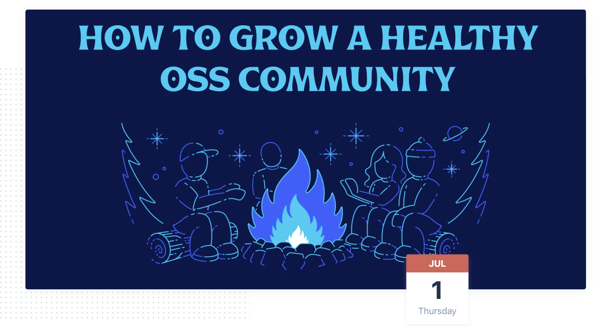

# Growing Open-Source community?

The community can aid open-source projects not just with source code contributions, but also through product feedback, documentation and examples, and other resources that help a project succeed.   
  
**But how can you build and manage open-source project communication, as well as encourage and coordinate volunteer groups, all while building a welcoming, helpful culture that builds community?**

## Summary:

* structuring the project with _**promotion paths**_
* _**hierarchy of advancement**_ in open source projects
* _**Holding yourself accountable**_ for the communities and making sure you start initiatives to stay interested. 
* setting _**clear paths for learning**_ and advancement
* _**Establishing your intentions, boundaries, and interests**_ — and communicating that \(or being open to hearing this is so important!  

## Scribbles:

###  **Characteristics of a good open-source community...**

* structure
* knowing _**who**_ to talk to
* documentation
* steps how to contribute
* the architecture
* structuring the project with promotion paths

### Ladder Model for Open Source

* hierarchy of advancement in open source projects
* allows for buying and learning 
* setting clear paths for learning and advancement

#### _Share your work with the community, do not hide behind your code and work._

* Have your readme at the bare minimum. Make it easier for the newbies! 
* Holding yourself accountable for the communities and making sure you start initiatives to stay interested. 
* Make sure your community shares the same goal as you. 
* Not accepting contributions in open-source == respectfully drawing a line about how much and what kind of engagement you want from the community, 
* Documentation \(blog posts, guides, etc\) and paying attention to the little details including down to social cards is super helpful especially in telling stories and intention.

###  Tackling imposter syndrome...?

#### Here's how Brian approaches impostor syndrome and making open source accessible - 

* I intentionally you're going to have a solution written in the issue, provide an easy win.
* Providing mentorship and help
* Giving credit where you can

####   The link to the talk will be shared soon. 😊👋🏼 

