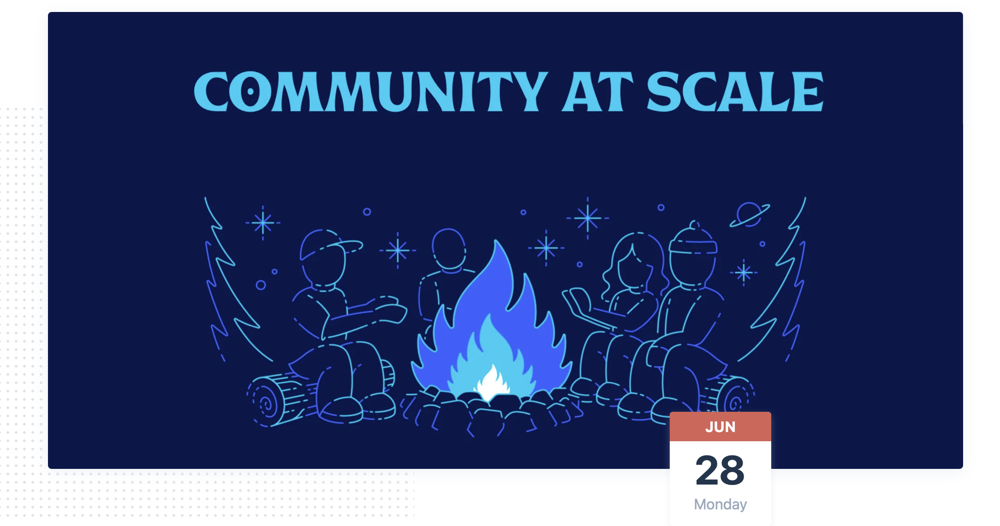

# Managing communities at scale

## Summary

* Notion's growth for a SaaS product has been commendable, especially over the last few years. 
* Unlike many SaaS products and companies out there, Notion stands out for its interesting artwork, characters, templates and massive community throughout the 🌏 ! 
* The community for Notion played a huge part in their growth, like any other company, when they got such an overwhelming response from the community side, rather than doing nothing about it, they tried to sit down with the leads and conversing about the situation and how they could make them feel more empowered. 
* Notion then rolled out their ambassador program and then rest my friends, is history. 

## Scribbles

* _**Investing early in communities**_ helps in the long run. 
* Biggest pieces initially starting up the community were _**templates**_ and _**ambassador program**_. 
* Other two things they focused on: Top of _**funnel sign ups**_, helping _**users**_ understand _**how to use notion better**_.
* Lessons learned ****_**from empowering ambassadors --**_ work to make sure they're feeling as supported as possible, and helping them tap into what they manage most
* _**Fostering better relationships with core users**_ - making people who already value your product feel valued.
* _**Word of mouth**_ is still a very reliable and trustworthy tool that can be leveraged by building genuine community leads. 
* Why invest heavily in marketing when you have _**ambassadors**_? 🙃  No like for real, there are always people out there who genuinely believe in the product and do not look for any monetary value -- For folks likes these, being part of the community, contributing toward's the growth of the product is more satisfying than the monetary value to compensate for their time invested in the process. 
* _**Tips for bettery community lead**_ - Systemize things faster. Build systems and processes. Document everything whenever possible.
* Notion employees favorite notion tool? -- keyboard shortcuts, callouts, toggles, 
* _**Notion's unique artwork**_ has helped achieve a _**unique branding**_ of its own. It has also become a huge marketplace for templates, logos, characters and all sorts of artwork inspired by existing Notion's theme.   

#### Link to the talk, hosted on Twitter space will be shared by the team soon. 

