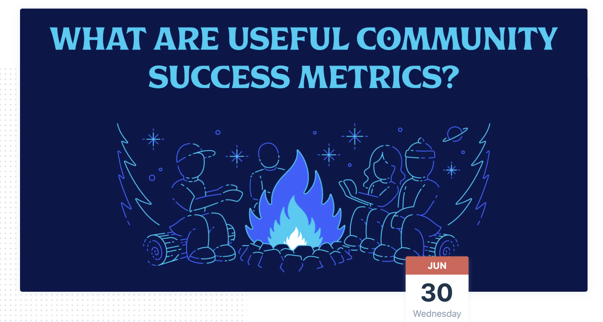

# What are useful community metrics?

The difficulty for developer relations has always been how to collect quantitative data to demonstrate value, and most teams approach this in different ways based on team size and company stage. Join us as we examine what tales you can tell to assist leadership to understand what you do, which ones are beneficial, and why data presentation is so important.

**🎙 Speakers:**

**Jeremy Meiss** \([@IAmJerdog](https://twitter.com/IAmJerdog)\) is the Director of DevRel & Community at CircleCI, formerly at Solace, Auth0 and XDA. He is active in the DevRel community and is a co-creator of DevOpsPartyGames. A lover of all things coffee, community, open-source, and tech, he is also house-broken, and \(generally\) plays well with others.

​**Joe Nash** \([@jna\_sh](https://twitter.com/jna_sh)\) is a developer educator at Twilio, supporting learners and educators using TwilioQuest. In the past, Joe has worked for students at companies like GitHub and Unity. Joe doesn't believe in clocks, but like the Ancient Egyptians, does believe that geese are sacred.

​**Mary Thengvall** \([@mary\_grace](https://twitter.com/mary_grace)\) is a connector of people at heart, personally and professionally. She loves digging into the strategy of how to build and foster developer communities and has been doing so for over 10 years. Mary is the Director of Developer Relations at Camunda, an open-source process automation platform, and the author of the first book on Developer Relations: The Business Value of Developer Relations \(© 2018, Apress\).

​**Matthew Revell** \([@matthewrevell](https://twitter.com/matthewrevell)\) is the founder of DevRelCon and DeveloperRelations.com, as well as working as a developer relations consultant with companies of all sizes in the US, Europe, Asia, and Australasia.  

**The first thing you will hear from any experienced person about metrics is "It depends" -- "It totally depends", plus they also might give a smirk or say "ufffff", cause this is one of the hardest questions out there.**   
Metrics depends on the questions we're asking. We need to ask why first. Why do we need metrics? Where we are? What are the problems we are trying to solve?

### Scribbles:

* What is a useful success metric?
  * it depends, where you are, what state you are at
  * if you go down the metrics you want to have, you are missing the point.
  * what answers are you trying to solve?

  

