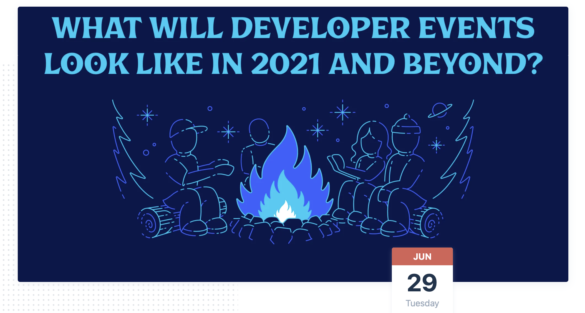

# How will developer events look like in 2o21 and beyond 🤔 ⁉️ \(Orbit's Community Camp\)

### Speakers

**Em Lazer-Walker** \([@lazerwalker](https://twitter.com/lazerwalker)\) is a Toronto-based artist/engineer and Senior Cloud Advocate at Microsoft. Most of her work focuses on using nontraditional interfaces to reframe everyday objects and spaces as playful experiences and to inspire people to become self-motivated learners. In the past, she’s worked at companies like Pivotal Labs and Etsy, on games and apps such as Words With Friends and Timehop, and as a researcher in the MIT Media Lab's Playful Systems research group. She’s passionate about fostering diverse and inclusive communities and organizes game industry events such as the [Roguelike Celebration](https://roguelike.club/) and the annual [alt.ctrl.PARTY](https://alt.ctrl.party/).

​**Jon Gottfried** \([@jonmarkgo](https://twitter.com/jonmarkgo)\) is the co-founder of [Major League Hacking](https://mlh.io/), the global student developer community. Jon previously worked as a Developer Evangelist at Twilio and Echo Nest served as National Director for StartupBus and co-created the Hacker Union. Jon loves creating new technology and teaching people to do the same. He graduated from SUNY Stony Brook University in 2011 and was recently named to the Forbes 30 Under 30 for Education and the Stony Brook University 40 Under 40 for Entrepreneurship.

​**Suze Shardlow** \([@SuzeShardlow](https://twitter.com/SuzeShardlow)\) is a multi-award-winning tech community manager, technical author, event MC and coding instructor. She is the online event and community host for CFE.dev, a Florida-based virtual meetup and technical training company. As Community Lead for Ladies of Code London, Suze manages the Slack community and, during COVID-19, has so far delivered 250+ hours of live tech content including weekly online co-working sessions and fireside career chats with women in tech for a meetup and YouTube series. She curated and MCd the six-hour live stream for Global Diversity CFP Day 2021, is a community host and a moderator for the Leapers freelancers' Slack and teaches coding to university lecturers.

**Online event opportunities**:

* Accessible.
* Cheaper.
* Logistic ease.
* Low barriers to entry.
* Less risky.
* Lots of room for creativity without investing a lot.
* More room for creativity without limitations of physical space.
* More options to comfortably interact \(Text chat, audio, video\)
* GREAT MEMES ONLINE!
* Online events attract more people.
* People overcome hesitation to attend.
* More comfortable online - you can choose your own engagement level.
* People who have mobility issues can attend \(excellent point\)
* Speakers always turn up.

\*\*\*\*

**Hybrid Events:** 

**Emilia:** - Events are social experiences, talks are important but not the main thing. -- Harder to bridge the gap between in-person and online. - For Emilia, online and in-person would serve different purposes.   
**Jon:** - Depends on the nature of the event. Easy for hackathons, harder for conferences. - Serendipity online vs in-person may not have a lot of overlap. - We need to know what part of an in-person event will get value from having an online component, taking the whole event online may not make perfect sense or be feasible.   
**Suze:** - Challenges of covering in-person events via video and taking them online fully. - Reaching out to speakers is hard for in-person events. - Issues finding accessible and inclusive venues - some people can't go to bars for example. - Inclusive timings are still a challenge ****everyone's being cautious about hybrid events!

\*\*\*\*

**Q: How can we get more people to attend events?**

* Try to think more about reach than attendance.
* Reusing assets from events afterwards. 
* Online events might have greater reach post-event, youtube videos for example. - Low attendance could be because of Zoom fatigue. 
* Rethink online event as not just a Zoom call, but maybe say as a Youtube playlist. Async vs Sync. 
* People look for social aspects in events, if that can be replicated online, then it might be helpful.

One of the main things to always remember is that each event -- online, hybrid or physical, it's those little decisions made by the core team that can eventually make the event successful and now it depends on how you set the metrics for success.

