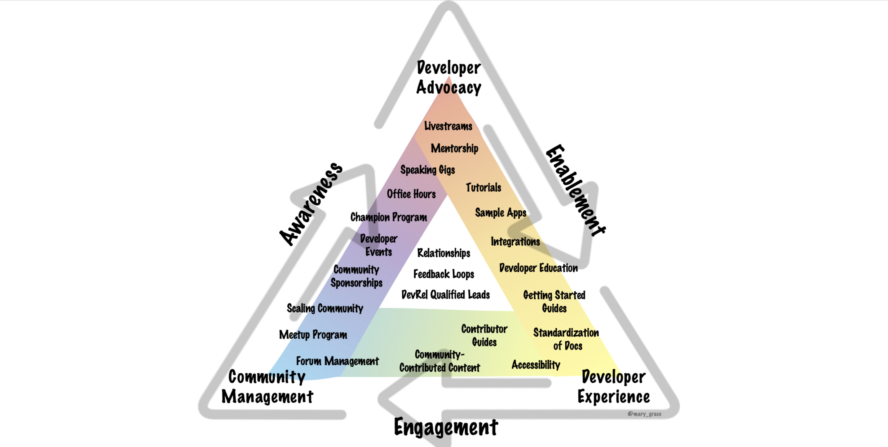

# Path to success for DevRel



## Summary:

## Scribbles:

### Foundational Categories- 

* _**Awareness**_ 
  * Making sure that developers know about the product, making them aware of the targetted product's existence.
* _**Enablement**_ 
  * Documentations, guides, tutorials, existing libraries, use-cases, etc. to enable the developers to use your product. 
  * Making developers understand that using your product solves their problems can be a huge plus point for them to adopt the product.
* _**Engagement**_ 
  * Engaging with the community.   

### 3 Functions of Developer Relations- 

* Developer Advocacy
* Developer Experience
* Community management 

### Developer Advocacy

* Responsible for making sure the community is _**aware**_
* Producing content like blogposts, live streaming, public speaking/talks, etc.
* Building relations ships in tech industry. 
* Making sure the team is aware of relevant feedback from the community. 

### Developer Experience 

* Responsible for standardization, accessibility of documentation for developers. 
* ^ allows to put the team a finish touch after a fantastic talk from the developer advocate at a tech conference. 
* Gives people the confidence to know that the product can solve their problems with the help of fantastic guides and resources available. 

### Community Management

* Working with most engaged community memebers.
* ^ those who run meetups, speak at events on the company's behalf.
* Goal is to build stronger community of people as well as connections.

### Internal Community

#### Internally -&gt; Co-workers

* Awareness OF
  * team's existence
  * feedback that the community is willing to provide
  * types of processes that can be provided
  * DevRel qualified leads
* Enabling to 
  * serve the community better 
  * bettter communitcate with customers
  * write, speak and code in public. 
* Engagin co-workers with the community with conferences, social media, forums, etc.

#### Externally -&gt;

* Awareness OF
  * existence of various products and projects
  * team and mission
  * resources
* Enabling THEM
  * get up and running quickly and easily
  * successful in their role
  * try new things along with amplification of work
* Engaging
  * using forums, slack, social media, conferences, meetups
  * contributing and collaborating to move members up the pyramid of engagement

### How to find balance b/w the 3

* Understand company goals
* Find allies in your company
  * Awareness in marketing dept.
  * Enablement in product and engineering.
  * Engagement in support and customer sucess team. 
* Prioritizing your task and working across teams to accomplish goals. 

