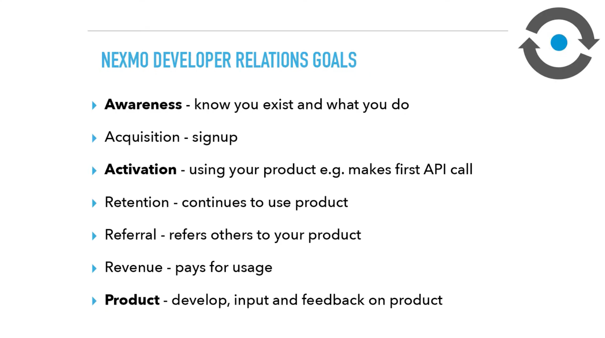
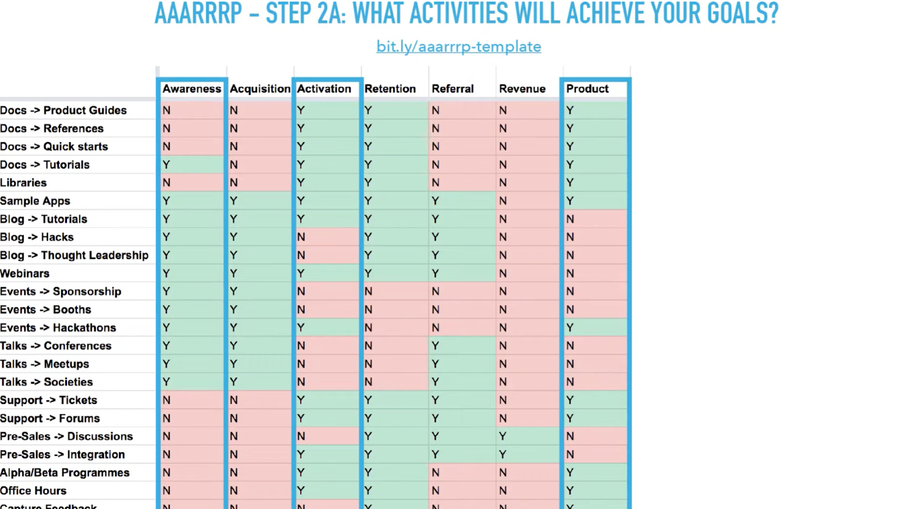

# Introduction to the AAARRRP devrel strategy framework



## Summary:

* What is the AAARRRP, developer relations framework
* The basic steps to use that framework
* Dave McClure’s AARRR pirate metricsAcquisition
  * Activation
  * Retention. 
  * Referral. 
  * Revenue. 
* A..AARRR..P 
  * Awareness
  * AARRR
  * Product
* Using AAARRRP
  * Define your goals
  * Identify the activities to achieve those goals. 
  * Plan to execute. 
* Steps
  * **Define your goals** 
    * Mapping of the goals that your company has to the activities that you should undertake to achieve those. 
  * **Define activities to meet your goals**
    * Look at the activities, what activities will achieve those goals and how can you undertake them? 
  * **Planning the execution -- finding activities that help meet more than one goal.** 
  * **Complimentary activities**
    * Can you find the complementary nature of one activity meeting more than one goal and feeding into the next?
  * **Execute**
    * Really just taking the output of that and taking the resources, your thoughts about team well-being

## Scribble: 

### Dave McClure’s AARRR pirate metrics

* **Acquisition**
  * What these specifically mean will vary depending on what you’re doing and the company you’re working for.
* **Activation?** 
  * Using your product
  * Making that first API call or making a number of API calls that you deem as being activated.
* **Retention.** 
  * Can you keep them on the product? 
  * Are they making a few calls and they’re never coming back?
* **Referral.** 
  * Do you get enough people using your product and it’s so good that they start to invite other people to it?
  *  Do you have a referral mechanism?
* **Revenue.** 
  * You need to get paid. So, it is an obvious metric.

### A..AARRR..P 

#### Awareness. 

* Raising awareness about your product 
* Not pushing folks to sign up but letting them know that you exist.

#### Product. 

* Building the libraries
* Writing documentation
* Providing feedback on the product. 

### Using AAARRRP

* **Define your goals**
  * So, do I want to acquire new users?
  *  Do I want to activate users? 
  * Do I want to get users to refer? 
  * Do I want product feedback? 
* **Identify the activities to achieve those goals.** 
* **Plan to execute.** 
  * Framework itself doesn’t talk about how you plan your execution. 
  * You need to take the output of this and ultimately take in a number of other factors.

### Steps

* **Define your goals with AAARRP**

* **Define activities to meet your goals**
  * Identify what the activities are that achieve goals. 
  * Can you find these activities that meet more than one goal? 
  * That’s a good way of utilizing your time well. 
  * And can you find complementary activities, something that feeds into the next?

* **Planning the execution -- finding activities that help meet more than one goal.** 
  * Some weighting.
  * Need to put some additional effort into certain things such as documentation, so we’ve added a weighting column. 
* **Complimentary activities**
  * Can you find complementary activities? 
  * An efficiency measure
  * It’s a natural flow in how you work. 
  * “If we can improve the product and then we can create content demonstrating about how we can improve the product”
  * We can define how we attempt our developer relations, strategy and then do a talk on it, it naturally feeds into the next thing. 
  * So, we’re creating content. And in creating the content, we increase awareness.
* **Execute**
  * Guided by your company and team’s values. 
  * Team headcount.
  * Budgets.
  * Team well beings 
    * Managing Burnouts
    * Taking feedbacks 
    * Communication 
  * Evangelism Or Advocacy
  * Team member responsibilities 

###  The DevRelOMeter

* You look at the activities that you’re doing and it defines the type of work you’re doing. Whether you’re an evangelist or an advocate. 
* Advocacy is a two-way conversation between the customers and the product and engineering teams.
* Evangelist is more you’re given the product as the first customer, and then you take that to market, the developer market.

### Team member responsibilities

* Many organizations group their teams and the activities that they do by function. 
  * Building products, writing documentation, doing API tools, SDKs and libraries. Community, -- startup or general community activities. 
* Developer relations point of view, you probably sit in the outreach marketing. 
* As creative individuals -- It’s very difficult to pigeon into doing just one function. 
* Allow individuals to work from end to end, through involvement in the product, involvement in documentation, the API tools libraries, community involvement and outreach.

